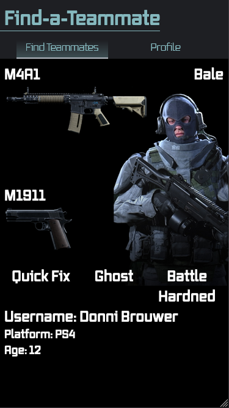

# Find a teammate

Hello and welcome to my repo, in this repo you'll find my progress for the matching feature I'm creating for a school project. The feature will be part of a bigger application which is going to be made in a few weeks. My feature will focus on Call of Duty players and help them find new teammates they like. It will allow people to update their profile and add more profiles. I want to add a login function later on but for now I'm focussing on getting the first part done.



## My Job Story

When I've got a new favorite weapon, I want to be able to update my profile, so my profile will remain up to date.

## Requirements

To work on this project you'll need [npm and nodejs.](https://www.npmjs.com/get-npm)

## How to clone this repo

Start by cloning this repo locally, open the terminal and run:
`git clone https://github.com/christiaanbraun/find_a_teammate.git`

After that you can use the terminal to navigate to the folder you just created. (You can also just use the GUI of your OS of course)
`cd find_a_teammate`

## Installing needed packages

Open the folder and run this command in the terminal:

`npm install`

## Setting up a database

This project requires a database connection. MongoDB provides a [guide](https://docs.mongodb.com/guides/server/drivers/) on how to create one.

After that you can link it to your local version of the app. Never upload your database username and password to Github!. Instead create a file called .env in your root directory and add the following:

```
DB_USER=your_username
DB_PASS=your_password
DB_NAME=your_dbname
```

## Staring the server

Start the server using the following command

`npm run dev-start`

Server should be running on http://localhost:5000/

## Datamodel

The data in the database is structured to the following model:

```JS
username: {
    type: String,
    required: true,
  },
  platform: {
    type: String,
    required: true,
  },
  age: {
    type: String,
    required: true,
  },
  primary: {
    type: String,
    required: true,
  },
  secondary: {
    type: String,
    required: true,
  },
  perk1: {
    type: String,
    required: true,
  },
  perk2: {
    type: String,
    required: true,
  },
  perk3: {
    type: String,
    required: true,
  },
  operator: {
    type: String,
    required: true,
    }
```

NB: This might be updated later.

## Questions or comments

If you've got any questions and or comments just shoot in an issue!
